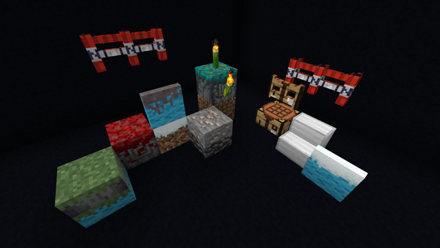

# HELP! I'm being framed!

HELP! I'm being framed! (or Framed, for short) is a
[Minecraft](https://www.minecraft.net/) mod for the
[Fabric](https://fabricmc.net/use/) mod loader.
There are no plans for a version for the Forge mod loader.

Framed adds several types of frames with various shapes. Each
frame can have its texture changed to that of any full-size block in
the game.

To use Framed, you must install [Fabric API](https://www.curseforge.com/minecraft/mc-mods/fabric-api).

Starting with version 1.1, you can also install [Conrad](https://www.curseforge.com/minecraft/mc-mods/conrad)
to configure certain parts of Framed.

## Info

- Framed is available through [GitHub Releases](https://github.com/alex5nader/Framed/releases),
[Modrinth](https://modrinth.com/mod/framed), and
[CurseForge](https://www.curseforge.com/minecraft/mc-mods/framed).
- Framed has a roadmap [here](https://github.com/alex5nader/Framed/projects/1).

## Thanks

Thanks to:
- The members of the [Fabric Discord](https://discord.gg/v6v4pMv) for their
incredible help and support throughout the creation of Framed.
- [Grondag](https://www.curseforge.com/members/grondagthebarbarian)
for immensely helping me understand the fabric rendering API.
- [Haven King](https://github.com/Hephaestus-Dev) for providing an incredible placement preview system.
- [LibGui](https://github.com/CottonMC/LibGui) for making GUI creation so easy.
- [Lil Tater Reloaded](https://www.curseforge.com/minecraft/mc-mods/lil-tater-reloaded)
for acting as an example of how to read assets/data.
- [Mineshopper](https://www.curseforge.com/members/mineshopper) for letting
me use assets from the original
[Carpenter's Blocks](https://www.curseforge.com/minecraft/mc-mods/carpenters-blocks).

## License

Some files modified from Haven King's
[Automotion](https://github.com/Hephaestus-Dev/Automotion) are licensed under
MIT. These files have a header indicating as such.

All other files are licensed
under the [LGPL v2.1](LICENSE.md).
